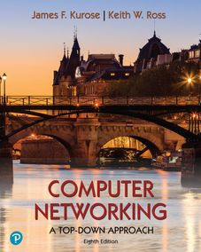

|  | :books: **Computer Networking: A Top-Down Approach, 8th Ed.**  :writing_hand: James F. Kurose, Keith Ross :mortar_board: University of Massachusetts, Amherst  :globe_with_meridians: [Pearson](https://www.pearson.com/us/higher-education/program/Kurose-Pearson-e-Text-Computer-Networking-Access-Card-8th-Edition/PGM2877610.html "Kurose & Ross, Computer Networking, 8th Edition \|Pearson")  :copyright:2021  *This print textbook is available for students to rent for their classes. The Pearson print rental program provides students with affordable access to learning materials, so they come to class ready to succeed."* |
| ------------------------------------------------------------ | :------------------------------------------------------------ |

---------

<h2>Homework Problems & Questions</h2>

> *"Tell me and I forget. Show me and I remember. Involve me and I understand."*
>
> 
[Chinese proverb]

:wave:Hello, world. I have created this repo to control the homework assignments of the best computer networking book I have ever put my hands on. **Computer Networking: A Top-Down Approach** is considered by many the best academic book for a first course on computer networking at a graduate level. It has been adopted by many hundreds of colleges and universities world-wide, translated into 14 languages (so you will very likely find an edition on your language), and used by literally millions students and practitioners worldwide.

I have recently started to study the subject and I am following all the authors' assignments, so I will commit my answers on `.md` files and all the practical assignments will be done on Python and using the Wireshark® for packet sniffing.

I would really appreciate if you could collaborate by creating issues not only for my codes but also for the theoretical home work assignments as you find anything wrong and/or that could be improved, since the students have not got access to the solutions on the authors’ website, only academic professors do.

Please find below how this repo is going to be organized.

>  :package: /computer-networking-book/
>
>  ┣ :file_folder: img
>
>  ┣ :open_file_folder: practice
>
>  ┃   ┗ :file_folder: wireshark-Labs
>
>  ┃   ┗ :page_facing_up: [lab0-TCPClient.py](practice/lab0-TCPClient.py)
>
>  ┃   ┗ :page_facing_up: [lab0-TCPServer.py](practice/lab0-TCPServer.py)
>
>  ┃   ┗ :page_facing_up: [lab0-UDPClient.py](practice/lab0-UDPClient.py)
>
>  ┃   ┗ :page_facing_up: [lab0-UDPServer.py](practice/lab0-UDPServer.py)
>
>  ┃   ┗ :page_facing_up: [lab1-WebServer.py](practice/lab1-WebServer.py)
>
>  ┃   ┗ :page_facing_up: ...
>
>  ┃   ┗ :page_facing_up: `lastLab.py`
>
>  ┣ :open_file_folder: theory
>
>  ┃   ┗ :page_facing_up: [chapter-1.md](theory/chapter-1.md)
>
>  ┃   ┗ :page_facing_up: [chapter-2.md](theory/chapter-2.md)
>
>  ┃   ┗ :page_facing_up: ...
>
>  ┃   ┗ :page_facing_up: `chapter-8.md`
>
>  ┗ :page_facing_up: `README.md`

