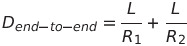
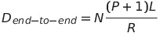
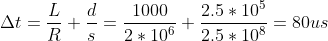
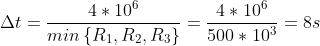

# Homework Problems and Questions ✍️

## Chapter 1 Review Questions 

> 1. *What is the difference between a host and an end system? List several different types of end systems. Is a Web server an end system?*

**Answer:**  Both 'host' and 'end system' are the same, both are systems that host/run internet applications. Examples of hosts are web servers, personal computers, smartphones and tablets, and more devices that comprehend the Internet of Things (IoT) such as home appliances, sensors, lights, TVs, traffic control systems, and wearables.

 

> 2. *The word protocol is often used to describe diplomatic relations. How does Wikipedia describe diplomatic protocol?*

**Answer:** *"**Protocol** is commonly described as a set of international courtesy rules. These well-established and time-honored rules have made it easier for nations and people to live and work together. Part of protocol has always been the acknowledgment of the hierarchical standing of all present. Protocol rules are based on the principles of civility. — Dr. P.M. Forni on behalf of the International Association of Protocol [Consultants](https://en.wikipedia.org/wiki/Consultants "Consultant - Wikipedia") and Officers."* ('Protocol (diplomacy)', [Wikipedia](https://en.wikipedia.org/wiki/Protocol_(diplomacy) "Protocol (diplomacy) - Wikipedia") 2021)

 

> 3. *Why are standards important for protocols?*

**Answer:** Computers are literal, so they need standards to make sure all the manufacturers and developers design their hardware and software in a way they can communicate properly. In computer networking the systems must communicate on the same "language", so the protocols standards set all the parameters, formats, rules, functions and behaviors of the computer networking. The Internet Standards are developed and maintained by the IETF: Internet Engineering Task Force [[IETF](https://www.ietf.org "IETF | Internet Engineering Task Force") 2021].

 

> 4. *List four access technologies. Classify each one as home access, enterprise access, or wide-area wireless access.*

**Answer:** 

|       Access Technology       |      Classification       |
| :---------------------------: | :-----------------------: |
| DSL (Digital Subscriber Line) |        Home access        |
|    HFC (Hybrid Fiber Coax)    |        Home access        |
|           Ethernet            |     Enterprise access     |
|           4G and 5G           | Wide-Area Wireless access |

 

> 5. *Is HFC transmission rate dedicated or shared among users? Are collisions possible in a downstream HFC channel? Why or why not?*

**Answer:** The HFC (Hybrid Fiber Coax) transmission rate is shared among users, it is a shared broadcast medium. In particular, every packet sent by the CMTS (Cable Modem Termination System, which converts the analog signal sent from the cable modems back to digital signal), at the cable head end, travels downstream on every link to every domestic modem and every packet sent by a home modem travels on the upstream channel to the CMTS. Collisions are possible, so a distributed multiple access protocol is needed to coordinate transmissions (more detail will be given in Chapter 6).

 

> 6. *List the available residential access technologies in your city. For each type of access, provide the advertised downstream rate, upstream rate, and monthly price.*

**Answer:**

| Access Technology        | Downstream rate | Upstream rate | Price |
| ------------------------ | --------------- | ------------- | ----- |
| HFC (Hybrid Fiber Coax)  |                 |               | R$    |
| FTTH (Fiber To The Home) |                 |               | R$    |
| Radio Waves              |                 |               | R$    |

 

> 7. *What is the transmission rate of Ethernet LANs?*

**Answer:** 10 Mbps, 100 Mbps, 1 Gbps and 10 Gbps.

 

> 8. *What are some of the physical media that Ethernet can run over?*

**Answer:** Twisted-pair cooper wires, Coax cables, Fiber optics, Terrestrial radio waves, and Satellite radio waves.

 

> 9. *HFC, DSL, and FTTH are all used for residential access. For each of these access technologies, provide a range of transmission rates and comment on whether the transmission rate is shared or dedicated.*

**Answer:**

| Access Technology             | Trans. Rates                                                 | Link      |
| ----------------------------- | ------------------------------------------------------------ | --------- |
| HFC (Hybrid Fiber Coax)       | Downstream: 24Mbps and 52Mbps Upstream: 3.5Mbps and 15Mbps | Dedicated |
| DSL (Digital Subscriber Line) | Downstream: 40Mbps and 1.2Gbps Upstream: 30Mbps and 100Mbps | Shared    |
| FTTH (Fiber To The Home)      | Downstream                                                   | Shared    |

 

> 10. *Describe the most popular wireless Internet access technologies today. Compare and contrast them.*

**Answer:** 

| WiFi (IEEE 802.11)                                           | 4G / 5G                                                      |
| :----------------------------------------------------------- | :----------------------------------------------------------- |
| In a WiFi LAN hosts communicate wirelessly with an AP (Access Point) connected to a wired network, most likely an Ethernet network. WiFi usually reach users in a radius of a few tens of meters, depending on the power of the Access Point. | Use the same wireless infrastructure used for cellular telephony to send and receive packets through a base station that is operated by the cellular network provider. 4G and 5G users may be within a few tens of kilometers away from the base station. |

 

> 11. *Suppose there is exactly one packet switch between a sending host and a receiving host. The transmission rates between the sending host and the switch and between the switch and the receiving host are R1 and R2 , respectively. Assuming that the switch uses store-and-forward packet switching, what is the total end-to-end delay to send a packet of length L? (Ignore queuing, propagation delay, and processing delay.)*

**Answer:**  

> Extra: You may now want to try to determine what the delay would be for *P* packets sent over a series of *N* links each of rate *R*.

**Answer:**  

 

> 12. *What advantage does a circuit-switched network have over a packet-switched network? What  advantages does TDM have over FDM in a circuit-switched network?*

**Answer:** A circuit-switched network has dedicated resources for communication between the hosts, a reserved link, not sharing the transmission rate with other hosts nor waiting on queues, having this way low (or no perceptible) delays. In TDM (Time-Division Multiplexing) each circuit continuously gets a fraction of the bandwidth because each frame (defined duration of time) is divided into a number of time slots; a circuit when stablished gets the same slot position in every frame. In FDM (Frequency-Divided Multiplexing) the circuit dedicates a frequency spectrum to each connection for the duration of the connection.

 

> 13. *Suppose users share a 2 Mbps link. Also suppose each user transmits continuously at 1 Mbps when transmitting, but each user transmits only 20 percent of the time. (See the discussion of statistical multiplexing in Section 1.3.)*
>     - *a) When circuit switching is used, how many users can be supported?*
>     - *b) For the remainder of this problem, suppose packet switching is used. Why will there be essentially no queuing delay before the link if two or fewer users transmit at the same time? Why will there be a queuing delay if three users transmit at the same time?*
>     - *c) Find the probability that a given user is transmitting.*
>     - *d) Suppose now there are three users. Find the probability that at any given time, all three users are transmitting simultaneously. Find the fraction of time during which the queue grows.*

**Answer:**

- a) For circuit switching only two users will be supported, each of them with a circuit of 1Mbps link, no matter of they are transmitting only 20% of the time.
- b) With two users (or fewer) are transmitting, even if using the full bandwidth, the rate of transmission in the link will not be overpassed so no queue will be formed. If three users transmit at the same time using full bandwidth there will be more flow of communication than the link is able to transmit, so a queue will be formed in the link.

 

> 14. *Why will two ISPs at the same level of the hierarchy often peer with each other? How does an IXP earn money?*

**Answer:** ISPs (Internet Service Providers) can peer with each other to share the costs of connecting to a higher-level ISP in a direct connection rather than using intermediaries. An IXP (Internet eXchange Point) is held by a third-party company which connects different ISPs to peer all together.

 

> 15. *Some content providers have created their own networks. Describe Google’s network. What motivates content providers to create these networks?*

**Answer:** Google has several datacenters across the globe, all interconnected with Google's own private network. They not only connect directly to the tier-1 ISPs bur also "bypass" the higher level ISPs connecting to lower level ISPs directly or via IXPs.; by doing it Google reduces their costs to upper-tier ISPs and provide a better and fast service to their end users.

 

> 16. *Consider sending a packet from a source host to a destination host over a fixed route. List the delay components in the end-to-end delay. Which of these delays are constant and which are variable?*

**Answer:**

| Qty of Nodes | Processing Delay | Queueing Delay | Transmission Delay | Propagation Delay |
| ------------ | ---------------- | -------------- | ------------------ | ----------------- |
| Constant     | Constant         | Variable       | Constant           | Constant          |

 

> 17. *Visit the [Transmission Versus Propagation Delay interactive animation](https://media.pearsoncmg.com/aw/ecs_kurose_compnetwork_7/cw/content/interactiveanimations/transmission-vs-propogation-delay/transmission-propagation-delay-ch1/index.html "Transmission Versus Propagation Delay interactive animation") at the companion Web site. Among the rates, propagation delay, and packet sizes available, find a combination for which the sender finishes transmitting before the first bit of the packet reaches the receiver. Find another combination for which the first bit of the packet reaches the receiver before the sender finishes transmitting.*

**Answer:** (Done online. This interactive animation is very didactic, I recommend to anyone studying computer networking.)

 

> 18. *How long does it take a packet of length 1,000 bytes to propagate over a link of distance 2,500 km, propagation speed 2.5 * 108 m/s, and transmission rate 2 Mbps? More generally, how long does it take a packet of length L to propagate over a link of distance d, propagation speed s, and transmission rate R bps? Does this delay depend on packet  length? Does this delay depend on transmission rate?*

**Answer:** 

The delay is directly proportional to the length of the packet (*L*) and inversely proportional to the transmission rate (*R*). It means that: the greater the packet length, the greater the delay; the greater the transmission rate, the smaller the delay.

 

> 19. *Suppose Host A wants to send a large file to Host B. The path from Host A to Host B has three links, of rates R1 = 500 kbps, R2 = 2 Mbps, and R3 = 1 Mbps.*
>     - *a. Assuming no other traffic in the network, what is the throughput for the file transfer?*
>     - *b. Suppose the file is 4 million bytes. Dividing the file size by the throughput, roughly how long will it take to transfer the file to Host B?*
>     - *c. Repeat (a) and (b), but now with R2 reduced to 100 kbps.*

**Answer:**

- a) The throughput is the minimum rate value, in this case, R1 = 500kbps.
- b) 
- c) Throughout would be R2 = 100kbps. It would take roughly 40 seconds to transfer the file.

 

> 20. *Suppose end system A wants to send a large file to end system B. At a very high level, describe how end system A creates packets from the file. When one of these packets arrives to a router, what information in the packet does the router use to determine the link onto which the packet is forwarded? Why is packet switching in the Internet analogous to driving from one city to another and asking directions along the way?*

**Answer:** System A would fragment the file into packets of a suitable size to be sent, all these packets should have parts of the main message (file itself), than would be encapsulated to be transported using the pertinent protocol, would be encapsulated again with the addresses of the sender and receiver, encapsulated again to be actually sent and in the end would physically be sent from System A heading System B.

When one of these packets gets to a router, the router converts the electrical (physical) signal and decapsulates the packet until it gets to the destination address, than it decides via which link to send the packet over, re-encapsulates the packet and ships it.

It is similar to this analogy of driving asking for directions along the way because the packet does not know how to get to the final destination, it has its address but is only travelling to the next node, where it asks for information (is routed) and follows to the next node, to ask for information again until it gets to the final host.

 

> 21. *Visit the [Queuing and Loss interactive animation](https://media.pearsoncmg.com/aw/ecs_kurose_compnetwork_7/cw/content/interactiveanimations/queuing-loss-applet/index.html "https://media.pearsoncmg.com/aw/ecs_kurose_compnetwork_7/cw/content/interactiveanimations/queuing-loss-applet/index.html") at the companion Web site. What is the maximum transmission rate and the minimum transmission rate? With those rates, what is the traffic intensity? Run the interactive animation with these rates and determine how long it takes for packet loss to occur. Then repeat the experiment a second time and determine again how long it takes for packet loss to occur. Are the values different? Why or why not?*

**Answer:** Maximum transmission rate: 1000 packets/s | Minimum transmission rate: 350 packets/s | Emission rate: 500 packets/s.

If the animation is run with the maximum transmission rate there will never be a packet loss because the transmission rate will be greater than the emission rate. If it is run with the minimum transmission rate, the emission rate will be greater than the transmission rate, so packet losses will start occurring after approximately 10 milliseconds. 

 

> 22. *List five tasks that a layer can perform. Is it possible that one (or more) of these tasks could be performed by two (or more) layers?*

**Answer:** Reliable delivery of messages between end points, for example, may be performed by more than one layer. Error check, addressing, transporting, translating end systems addresses to human-friendly name, web documents requests and transfers, are tasks the layers can perform.

 

> 23. *What are the five layers in the Internet protocol stack? What are the principal responsibilities of each of these layers?*

**Answer:** The five layers (top-down) are: Application, Transport, Network, Link, Physical.

- **Application:** is where de network applications reside (HTTP, DNS, SMTP, FTP, etc.)
- **Transport:** Transports application-layer messages between application sockets/endpoints (TCP, UDP)
- **Network:** Passes a transport-layer segment and its destination address and provides the service of routing the datagrams between sources and destinations (IP, routing protocols)
- **Link:**  Moves a packet form one node to the next node in the route, at this next node the link layer passes the datagram up to the network layer to be routed (Ethernet, WiFi, DOCSIS)
- **Physical:** Moves individual bits within the link-layer frames from one node to the next electrically.

 

> 24. *What is an application-layer message? A transport-layer segment? A network-layer datagram? A link-layer frame?*

**Answer:**

- **Application-layer Message:** is the packet of information that the network app is transferring from source to destination.
- **Transport-layer Segment:** the application layer delivers its message to the transport protocol which encapsulates the message and inserts all the pertinent information on the transport heading.
- **Network-layer Datagram:** the segment comes to the network layer where its IP addresses (destination and source) are added in the heading so the datagram can be properly routed on the link.
- **Link-layer Frame:** when the datagrams come to the link layer they need to be processed in order to be transmitted to the next node, so the link layer inserts its heading and the datagram is now called frame, that will promptly become electrical signal via the physical layer, depending on the protocol being used.

 

> 25. *Which layers in the Internet protocol stack does a router process? Which layers does a link-layer switch process? Which layers does a host process?*

**Answer:** A router needs to decapsulate the packet from the frame to the datagram, so it need to access the Network-layer Datagram, in order to route the packet correctly according to what is defined on the datagram heading. Hosts process all the layers of a packet, all the way from the physical layer to the message on the application layer, so apps on both hosts can communicate properly.

 

> 26. *What is self-replicating malware?*

**Answer:** It is a malware that once installs itself on a host starts attempting to distribute itself to other hosts via the internet or by contaminating memory devices.

 

> 27. *Describe how a botnet can be created and how it can be used for a DDoS attack.*

**Answer:** A botnet is created by a malware on a host which gives control to a malicious person to start sending packets to an specific victim. Thousands of botnets may be used to overwhelm a victim by sending a greater number of packets (or malicious packets) than the host may process, causing this way the host/server to stop responding to legit packets. It is called Distributed Denial-of-Service.

 

> 28. *Suppose Alice and Bob are sending packets to each other over a computer network. Suppose Trudy positions herself in the network so that she can capture all the packets sent by Alice and send whatever she wants to Bob; she can also capture all the packets sent by Bob and send whatever she wants to Alice. List some of the malicious things Trudy can do from this position.*

**Answer:** In this case Trudy is applying the Man-in-the-middle attack, where this malicious person may intercepting all the messages being transmitted between Alice and Bob this way having access to sensitive information such as passwords, credit card numbers, social security numbers, and private/personal information; Trudy may also send messages to Bob pretending to be Alice or messages to Alice pretending to be Bob.

 

---------

