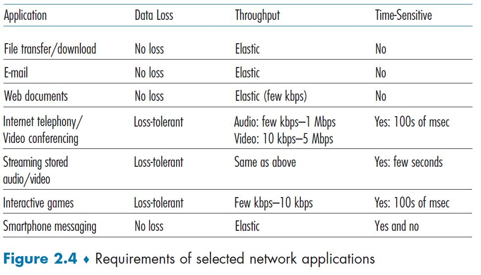

# Homework Problems and Questions ✍️

## Chapter 2 Review Questions 

> 1. *List five nonproprietary Internet applications and the application-layer protocols that they use.*

**Answer:**  

| World Wide Web  | E-mail                   | File Transfer | Voice Over Internet | Domain Names Interpretation |
| --------------- | ------------------------ | ------------- | ------------------- | --------------------------- |
| HTTP HTTPS | SMTP POP3 IMAP | FTP           | VoIP                | DNS                         |

 

> 2. *What is the difference between network architecture and application architecture?*

**Answer:** The network architecture is related to how the network is structure in terms of hardware (what devices are being used and how they are connected together) and of software (eg.: five-layer Internet architecture or seven-layer OSI model); on the other hand, the application architecture is designed by the app's developers and defines how the applications will communicate to the others in the various hosts the server/clients will be running (eg.: via HTTP, HTTPS, a proprietary protocol, etc.).

 

> 3. *For a communication session between a pair of processes, which process is the client and which is the server?*

**Answer:** The server is the service provider, it has a fixed an known address, IP and domain name, it is always on and waiting for clients requests, which will be made by the client sending packages to start the communication with the server. A good example is a host running a Web Server such as Apache and another host running a client Browser such as Chrome, the client must always start the communication with the server, in this case by sending a HTTP request to stablish communication; in this model the server never has the initiative of starting a communication with a client and two clients never communicate to each other (eg.: two browsers will never directly communicate to each other).

 

> 4. *For a P2P file-sharing application, do you agree with the statement, “There is no notion of client and server sides of a communication session”? Why or why not?*

**Answer:** I agree. Because in the P2P every host may act as a client - by requesting the files to be shared - and as server - by sending the files to be shared - at the same time. So the roles of client and server are interchangeable within the same host.

 

> 5. *What information is used by a process running on one host to identify a process running on another host?*

**Answer:** A process communicates with another process running on a remote host via a software interface called ***socket*** sending/receiving packets. Every packet comes with a transport header which brings the sender and receiver identifications, such as IP address and communication port number.

 

> 6. *Suppose you wanted to do a transaction from a remote client to a server as fast as possible. Would you use UDP or TCP? Why?*

**Answer:** UDP, because even though UDP does not offer a reliable connection it is faster for not having the process of stablishing a connection the the remote host (handshaking).

 

> 7. *Referring to Figure 2.4[^1], we see that none of the applications listed in Figure 2.4[^1] requires both no data loss and timing. Can you conceive of an application that requires no data loss and that is also highly time-sensitive?*

**Answer:** A messaging protocol the would need to be reliable and very fast; reliability would be necessary to make sure the message would get to its destination as it is supposed to be and it would be highly time-sensitive to keep the notion of instantaneous messaging exchange.

 

> 8. *List the four broad classes of services that a transport protocol can provide. For each of the service classes, indicate if either UDP or TCP (or both) provides such a service.*

**Answer:** 

|                        |        TCP         |        UDP         |
| :--------------------: | :----------------: | :----------------: |
| Reliable Data Transfer | :heavy_check_mark: |                    |
|       Throughput       | :heavy_check_mark: |                    |
|         Timing         |                    | :heavy_check_mark: |
|        Security        | :heavy_check_mark: |                    |

**Obs**: Neither TCP nor UDP provides security: the data sent from a process is the same data which travels the internet, in clear text. However, the Internet community has developed an enhancement for TCP called Transport Layer Security (TLS). TCP-enhanced-with-TLS provides encryption, data integrity, and end-point authentication.

 

> 9. *Recall that TCP can be enhanced with TLS to provide process-to-process security services, including encryption. Does TLS operate at the transport layer or the application layer? If the application developer wants TCP to be enhanced with TLS, what does the developer have to do?*

**Answer:** TLS is not considered a transport protocol, such as TCP and UDP are, but instead it is an enhancement of the TCP protocol, with these enhancements being applied on the application layer. If the developer wants to use TCP-TLS it is necessary to  implement some TLS code (there are highly optimized libraries and classes available [[RFC 5246]](https://datatracker.ietf.org/doc/html/rfc5246)) in both, server and client side applications. TLS has its own socket API, very similar to the TCP socket API. When the application uses TLS, it sends the clear text into the TLS socket, which encrypts the data and passes it to the TCP socket to be transported. The receiving process receives the packets into the TLS socket, which decrypts the data.

 

> 10. *What is meant by a handshaking protocol?*

**Answer:** As TCP is a connection-oriented service, it has this primer steps in which the client and server exchange transport layer control information with each other before the application layer communication starts. If both client and server are available and this messages exchange succeeds, a TCP connection is stablished between the sockets of both processes. This is what is called *handshaking* between hosts, it is a metaphor where both hosts agree to stablish a TCP connection, so they handshake sealing the deal.

 

> 11. *Why do HTTP, SMTP, and IMAP run on top of TCP rather than on UDP?*

**Answer:** 

 

> 12. *Consider an e-commerce site that wants to keep a purchase record for each of its customers. Describe how this can be done with cookies.*

**Answer:** 

 

> 13. *Describe how Web caching can reduce the delay in receiving a requested object. Will Web caching reduce the delay for all objects requested by a user or for only some of the objects? Why?*

**Answer:** 

 

> 14. *Telnet into a Web server and send a multiline request message. Include in the request message the If-modified-since: header line to force a response message with the 304 Not Modified status code.*

**Answer:** ISPs (Internet Service Providers) can peer with each other to share the costs of connecting to a higher-level ISP in a direct connection rather than using intermediaries. An IXP (Internet eXchange Point) is held by a third-party company which connects different ISPs to peer all together.

 

> 15. *List several popular messaging apps. Do they use the same protocols as SMS?*

**Answer:** 

 

> 16. *Suppose Alice, with a Web-based e-mail account (such as Hotmail or Gmail), sends a message to Bob, who accesses his mail from his mail server using IMAP. Discuss how the message gets from Alice’s host to Bob’s host. Be sure to list the series of application-layer protocols that are used to move the message between the two hosts.*

**Answer:**

 

> 17. *Print out the header of an e-mail message you have recently received. How many `Received:` header lines are there? Analyze each of the header lines in the message.*

**Answer:** 

 

> 18. *What is the HOL blocking issue in HTTP/1.1? How does HTTP/2 attempt to solve it?*

**Answer:** 

 

> 19. *Is it possible for an organization’s Web server and mail server to have exactly the same alias for a hostname (for example, `foo.com`)? What would be the type for the RR that contains the hostname of the mail server?* 

**Answer:** 

 

> 20. *Look over your received e-mails, and examine the header of a message sent from a user with a .edu e-mail address. Is it possible to determine from the header the IP address of the host from which the message was sent? Do the same for a message sent from a Gmail account.*

**Answer:** 

 

> 21. *In BitTorrent, suppose Alice provides chunks to Bob throughout a 30-second interval. Will Bob necessarily return the favor and provide chunks to Alice in this same interval? Why or why not?*

**Answer:** 

 

> 22. *Consider a new peer Alice that joins BitTorrent without possessing any chunks. Without any chunks, she cannot become a top-four uploader for any of the other peers, since she has nothing to upload. How then will Alice get her first chunk?*

**Answer:** 

 

> 23. *What is an overlay network? Does it include routers? What are the edges in the overlay network?*

**Answer:** 

 

> 24. *CDNs typically adopt one of two different server placement philosophies. Name and briefly describe them.*

**Answer:** 

 

> 25. *Besides network-related considerations such as delay, loss, and bandwidth performance, there are other important factors that go into designing a CDN server selection strategy. What are they?*

**Answer:** 

 

> 26. *In Section 2.7, the UDP server described needed only one socket, whereas the TCP server needed two sockets. Why? If the TCP server were to support n simultaneous connections, each from a different client host, how many sockets would the TCP server need?*

**Answer:** 

 

> 27. *For the client-server application over TCP described in Section 2.7, why must the server program be executed before the client program? For the client-server application over UDP, why may the client program be executed before the server program?*

**Answer:** 

 

---------

[^1]: 
